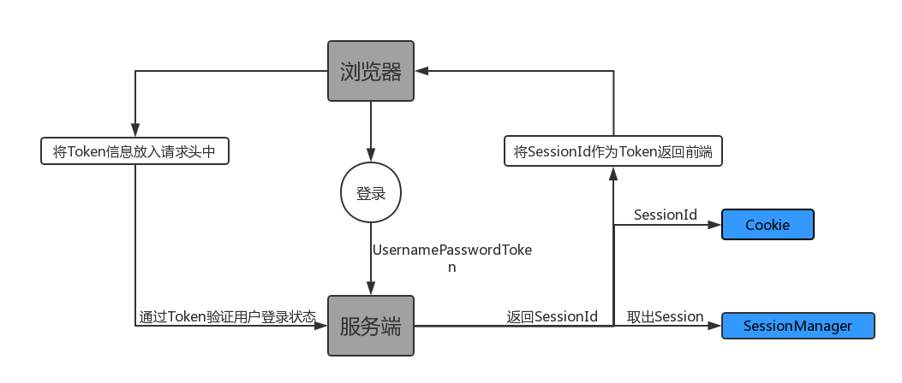
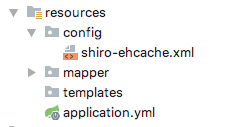
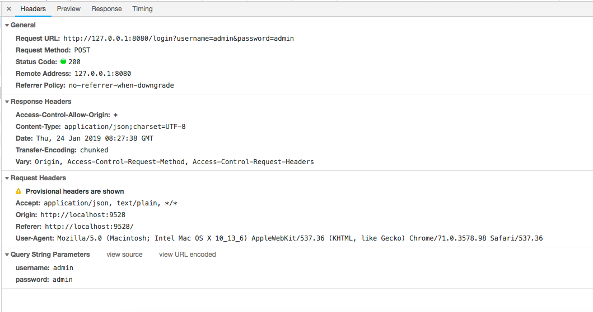
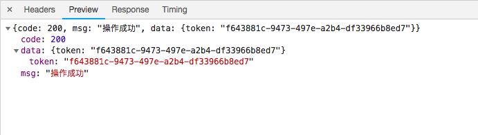
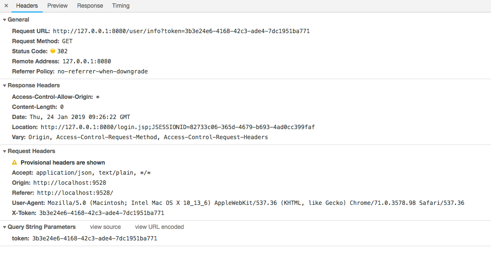
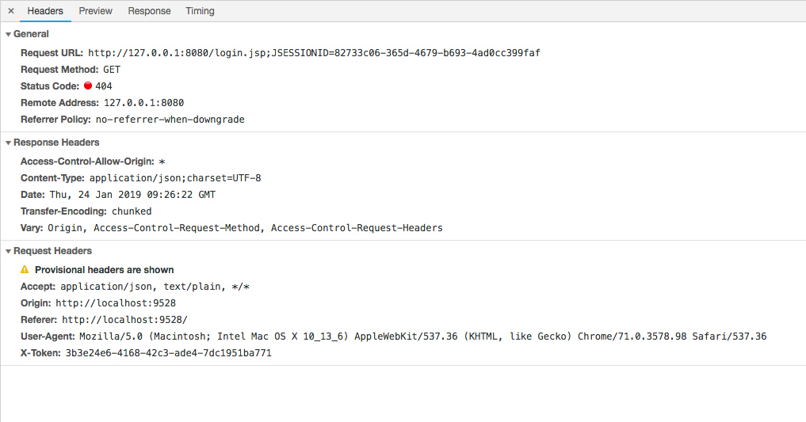
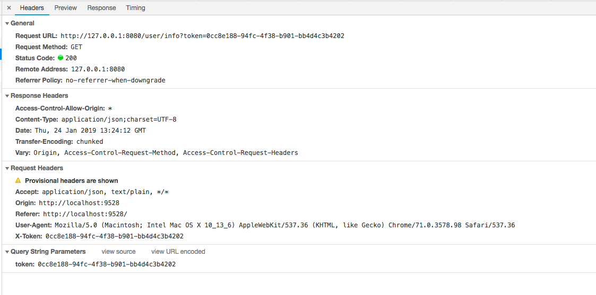
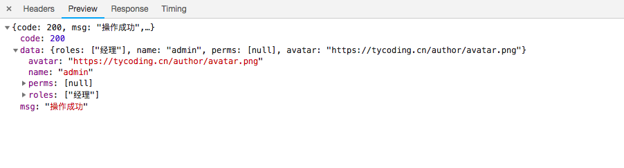

# Shiro笔记

**Shiro-Session**

Shiro提供*会话*管理实现用户于应用之间保持连接关系，在多次交互中能够识别当前访问的用户是谁，而这些会话信息由`SessionManager`管理。

## springboot+shiro+vue

### 后端

首先我简易的画一张登录校验的流程图：



#### Shiro Config

在前后端分离项目中，后端使用SpringBoot+Shiro，前端使用Vue.js；所有的请求都是通过ajax，如果我们要维持Shiro会话状态，就应该保证每次请求的`SessionId`都相同。

按照之前的方式，我这样写Shiro的配置文件`ShiroConfig.java`:

```java
@Configuration
public class ShiroConfig {

    @Bean
    public ShiroFilterFactoryBean shiroFilterFactoryBean(SecurityManager securityManager) {
        ShiroFilterFactoryBean shiroFilterFactoryBean = new ShiroFilterFactoryBean();
        shiroFilterFactoryBean.setSecurityManager(securityManager);

        //配置拦截器链，注意顺序
        Map<String, String> filterChainDefinitionMap = new LinkedHashMap<>();
        filterChainDefinitionMap.put("/logout", "logout");
        filterChainDefinitionMap.put("/login", "anon");
        filterChainDefinitionMap.put("/**", "user");

        shiroFilterFactoryBean.setFilterChainDefinitionMap(filterChainDefinitionMap);
        return shiroFilterFactoryBean;
    }

    @Bean
    public Realm realm() {
        return new AuthRealm();
    }

    @Bean
    public SecurityManager securityManager() {
        DefaultWebSecurityManager securityManager = new DefaultWebSecurityManager();
        securityManager.setRealm(realm());

        securityManager.setSessionManager(sessionManager());
        securityManager.setCacheManager(cacheManager());

        return securityManager;
    }

    @Bean
    public SessionManager sessionManager() {
        DefaultWebSessionManager defaultWebSessionManager = new DefaultWebSessionManager();
        defaultWebSessionManager.setGlobalSessionTimeout(1800000);
        defaultWebSessionManager.setSessionIdCookieEnabled(true);
        defaultWebSessionManager.setSessionIdCookie(simpleCookie());
        defaultWebSessionManager.setCacheManager(cacheManager());
        defaultWebSessionManager.setSessionIdUrlRewritingEnabled(true);
        defaultWebSessionManager.setSessionDAO(sessionDAO());
        return defaultWebSessionManager;
    }

    @Bean
    public SessionDAO sessionDAO() {
        EnterpriseCacheSessionDAO sessionDAO = new EnterpriseCacheSessionDAO();
        sessionDAO.setActiveSessionsCacheName("shiro-activeSessionCache");
        sessionDAO.setSessionIdGenerator(new JavaUuidSessionIdGenerator());
        return sessionDAO;
    }

    @Bean
    public SimpleCookie simpleCookie() {
        SimpleCookie simpleCookie = new SimpleCookie();
        simpleCookie.setName("cn.tycoding.id");
        simpleCookie.setHttpOnly(true);
        simpleCookie.setMaxAge(180000);
        return simpleCookie;
    }

    /**
     * Shiro本身只提供了Cahche缓存的接口，并不提供实现类。EhCacheManager是Shiro-Cache的一个实现类
     *
     * @return
     */
    @Bean
    public CacheManager cacheManager() {
        EhCacheManager cacheManager = new EhCacheManager();
        cacheManager.setCacheManagerConfigFile("classpath:config/shiro-ehcache.xml");
        return new EhCacheManager();
    }
}
```

因为使用`EhCache`做缓存，我们需要引入`EhCache`的pom依赖：

```xml
 <dependency>
    <groupId>org.apache.shiro</groupId>
    <artifactId>shiro-ehcache</artifactId>
    <version>1.4.0</version>
    <exclusions>
        <exclusion>
            <groupId>org.apache.shiro</groupId>
            <artifactId>shiro-core</artifactId>
        </exclusion>
    </exclusions>
</dependency>
```

按照上面的方式，我们还需要定义`EhCache`缓存的配置文件：`shiro-ehcache.xml`



```xml
<ehcache>
    <defaultCache
            maxElementsInMemory="10000"
            eternal="false"
            timeToIdleSeconds="120"
            timeToLiveSeconds="120"
            overflowToDisk="false"
            diskPersistent="false"
            diskExpiryThreadIntervalSeconds="120"
    />
    <!-- 登录记录缓存锁定10分钟 -->
    <cache name="passwordRetryCache"
           maxEntriesLocalHeap="2000"
           eternal="false"
           timeToIdleSeconds="3600"
           timeToLiveSeconds="0"
           overflowToDisk="false"
           statistics="true">
    </cache>
</ehcache>
```

#### LoginController

在上面已经介绍了，如果用户登录成功，后端应该返回给前端一个`Token`值，于是，这个`Token`值应该是Shiro生成的`sessionId`，那么我们在`LoginController.java`中这样定义：

```java
@PostMapping("/login")
public ResponseCode login(@RequestParam("username") String username,
                          @RequestParam("password") String password) {
    UsernamePasswordToken token = new UsernamePasswordToken(username, password);
    try {
        Subject subject = SecurityUtils.getSubject();
        if (subject != null) {
            logger.info("subject==>{}", subject);
            subject.logout();
        }
        super.login(token);
        return new ResponseCode(StatusEnums.SUCCESS, subject.getSession().getId());
    } 
    ...
}

@GetMapping("/logout")
public ResponseCode logout() {
    getSubject().logout();
    return new ResponseCode(StatusEnums.SUCCESS);
} 
```

## 前端

上面介绍了后端接口设计，这里我们看一下前端ajax的请求格式和后端的响应数据：

**login**



响应数据：



<br/>

**登录后的ajax请求**



你会发现上面的请求竟然是`302`重定向了，也就是说这个请求被Shiro拦截了，而我们在上上图中已经登过了啊，为什么还会被Shiro拦截呢？(记得之前配置了自定义拦截器链`/** = user`)。

紧接着你会发现浏览器会跳转到另一个请求地址：



### 思考

为什么会自动跳转到`http://127.0.0.1:8080/login.jsp;JSESSIONID=XX`这个地址？
* 因为我们自定义配置的拦截器链`/** user`拦截了这个请求，Shiro默认将拦截的请求都跳转到loginUrl地址（默认是`login.jsp`）。

为什么302重定向后的地址还携带了`JSESSIONID`？
* Shiro在用户登录后会生成Session信息，SessionId就是这个Session的标识key。也就是Shiro在执行自定义拦截器链的时候判断到新的请求（产生）的sessionId和系统已缓存的sessionId不同，所以Shiro判断这个请求是未登录不合法请求，所以被拦截并重定向到loginUrl地址。

为什么重定向后的请求是404？
* 这个很显然了，因为根本没有这个地址，我们采用的前后端分离开发，前端用的Vue(Node.JS)和后端页面完全不一回事。


## 思考

因为采用了SpringBoot + vue的前后端分离的开发模式，前端与后端都通过ajax的方式进行交互。

那么可以看到，后端通过`SecurityUtils.getSubject().getSession().getId()`获取到的SessionId和登录时已经返回给前端的SessionId(Token)是不同的。也就是你会发现，每次请求都产生一个全新的SessionId，导致Shiro认为你新的请求在已有的Session中没有查询到登录状态而拦截。

（Shiro的`sessionId`是通过`org.apache.shiro.session.mgt.eis.JavaUuidSessionIdGenerator`生成的随机值。）

为了保证用户登录后的请求都应该被Shiro识别为已登录用户的请求，我们应该保证前端每次请求都在请求头中定义一个参数值为后端传来的SessionId(Token)，这部分前端以实现了，看下：

```javascript
service.interceptors.request.use(
  config => {
    if (store.getters.token) {
      config.headers['X-Token'] = getToken() // 让每个请求携带自定义token 请根据实际情况自行修改
    }
    return config
  },
}
```

利用`Vuex`技术，会将用户已登录的Token信息写入全局store中，这样前端每次的`axios`请求的`Request Headers`中都将包含`X-Token`这个属性，其值是后端返回的sessionId。



那么后端应该如何接收呢？

## 改进

为了保证前端的每次请求都是已登录用户的请求，后端应该接收`Request Headers`中`X-Token`的值，并以它作为sessionId让Shiro去验证用户的请求。

因为Shiro的`Session`由管理器`org.apache.shiro.session.mgt.SessionManager`进行统一管理，所以应该修改其的sessionId值，又因为`SessionManager`只是一个接口，通常用它的`DefaultWebSessionManager`实现类来管理Session，所以我们改造一下`DefaultWebSessionManager`即可：

新建`MySessionManager.java`:

```java
public class MySessionManager extends DefaultWebSessionManager {
    private Logger logger = LoggerFactory.getLogger(this.getClass());

    private static final String AUTHORIZATION = "X-Token";
    private static final String REFERENCED_SESSION_ID_SOURCE = "Stateless request";

    public MySessionManager() {
    }

    @Override
    protected Serializable getSessionId(ServletRequest request, ServletResponse response) {
        logger.info("==> already to MySessionManager");
        //获取请求头中X-Token中保存的sessionId
        String id = WebUtils.toHttp(request).getHeader(AUTHORIZATION);
        if (!StringUtils.isEmpty(id)) {
            request.setAttribute(ShiroHttpServletRequest.REFERENCED_SESSION_ID_SOURCE, REFERENCED_SESSION_ID_SOURCE);
            request.setAttribute(ShiroHttpServletRequest.REFERENCED_SESSION_ID, id);
            request.setAttribute(ShiroHttpServletRequest.REFERENCED_SESSION_ID_IS_VALID, Boolean.TRUE);
            return id;
        } else {
            //否则默认从cookie中获取sessionId
            return super.getSessionId(request, response);
        }
    }
}
```

这样每次请求都被`MySessionManager`拦截到，并通过`getHeader(AUTHORIZATION)`获取到请求头`Request Headers`中的`X-Token`信息并将其设置为`SESSION_ID`。这样就保证了每次请求的`sessionId`和已登录用户的`sessionId`相同了，Shiro就不会拦截这些请求了。

**如何使用呢？**

在`ShiroConfig.java`配置文件中将`SecurityManager`中注入的`SessionManager`改为自定义的`MySessionManager`:

```java
    //自定义SessionManager
    @Bean
    public SessionManager sessionManager() {
        MySessionManager mySessionManager = new MySessionManager();
        mySessionManager.setCacheManager(cacheManager());
        mySessionManager.setSessionIdUrlRewritingEnabled(true);
        return mySessionManager;
    }
```

这样，再次请求接口：




就解决了Shiro重定向的问题了。


## Shiro使用Redis做缓存

上面我们使用了`EhCache`作为缓存，那么我们也可整合Redis，把Shiro的缓存信息储存到Redis中。

使用[shiro-redis](https://gitee.com/iherus/shiro-redis)开源插件，导入依赖：

```xml
<dependency>
    <groupId>org.crazycake</groupId>
    <artifactId>shiro-redis</artifactId>
    <version>2.4.2.1-RELEASE</version>
</dependency>
```

**修改配置文件**

* `org.apache.shiro.cache.CacheManager` -- `org.crazycake.shiro.RedisCacheManager`

* `org.apache.shiro.session.mgt.eis.SessionDAO` -- `org.crazycake.shiro.RedisSessionDAO`

* `org.apache.shiro.cache.CacheManager` -- `org.crazycake.shiro.RedisCacheManager`

```java
/**
 * 使用shiro-redis配置
 *
 * @return
 */
@ConfigurationProperties(prefix = "redis.shiro")
public RedisManager redisManager() {
    return new RedisManager();
}

/**
 * redis实现缓存
 *
 * @return
 */
@Bean
public RedisCacheManager cacheManager() {
    RedisCacheManager redisCacheManager = new RedisCacheManager();
    redisCacheManager.setRedisManager(redisManager());
    return redisCacheManager;
}

/**
 * 使用Redis实现 shiro sessionDao
 *
 * @return
 */
@Bean
public RedisSessionDAO redisSessionDAO() {
    RedisSessionDAO redisSessionDAO = new RedisSessionDAO();
    redisSessionDAO.setRedisManager(redisManager());
    return redisSessionDAO;
}
```

**修改`application.yml`，添加：**

```xml
redis:
  shiro:
    host: 127.0.0.1
    port: 6379
    timeout: 0
    password:
```

至此，Shiro-Redis的配置已完成，下面，需要在本地电脑上安装Redis（同时可以选择安装操作Redis的可视化工具）。
可以参考这篇教程：[Redis及Spring-Data-Redis](https://tycoding.cn/2018/09/24/redis/#more)

先启动本地Redis服务，再启动项目，登录系统，发现Redis数据库中就缓存了登录的`session`数据：


<br/>

上述是我个人在整合SpringBoot+Shiro+VueJS过程中遇到的问题，并（收集）整理的解决办法。


由于本人菜鸡，可能分析的有错误，欢迎大佬指出。

