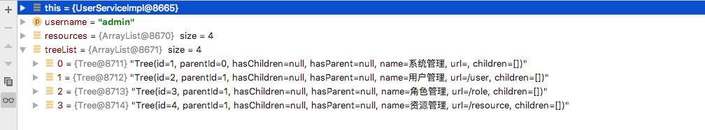
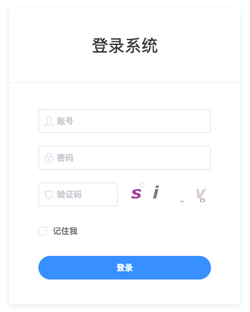
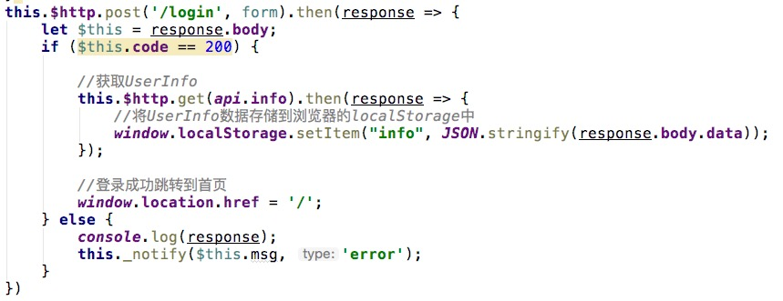
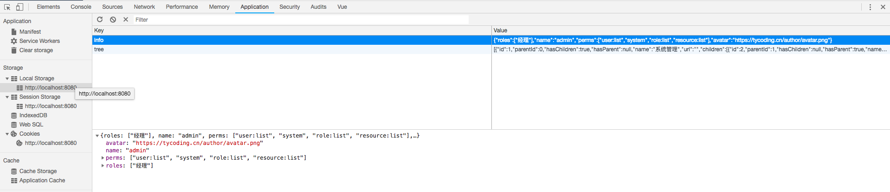
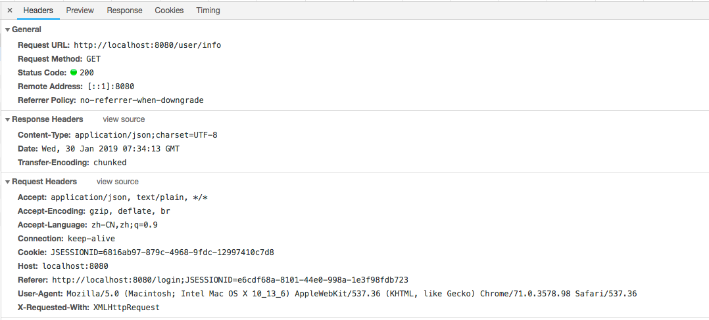
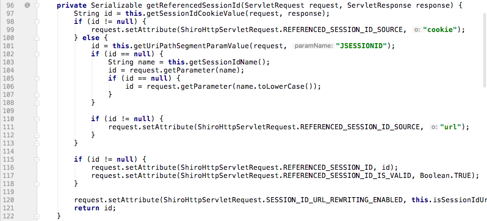
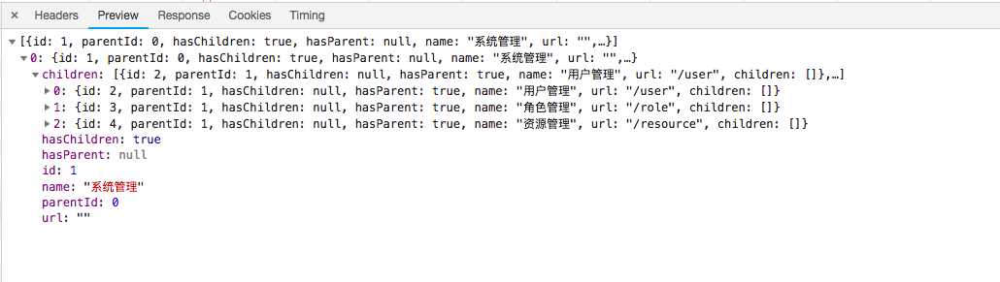
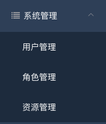

# 如何构建一个Tree树，并在前端渲染成Tree菜单？

## 后端

为什么要构建一棵Tree树？在权限管理系统中（或说是本例中），Tree树主要用于构建前端不同权限展示的不同菜单，这个菜单的名称和URL地址保存在数据库中，当用户登录后，查询到此用户对应角色的资源菜单，并封装为集合对象已JSON格式返回给前端渲染。

### Tree

那么首先后端封装Tree树的结构：

```java
@Data
@ToString
public class Tree<T> {

    private Long id; //节点ID

    private Long parentId; //父节点ID

    private Boolean hasChildren; //是否有子节点

    private Boolean hasParent; //是否有父节点

    private String name; //节点名称

    private String url; //节点URL

    private List<Tree<T>> children = new ArrayList<>(); //子节点信息
}
```

当然以上的属性仅用来测试举例，结合项目的实际情况定义。关于数据库表结构的定义可以参看：[Shiro权限表设计](https://www.tycoding.cn/2018/09/15/shiro-database/)

### Service

定义了Tree实体结构，下面我们看前端请求当前用户资源菜单的Service层实现：

```java
@Override
public List<Tree<Resource>> getResource(String username) {

    //获取用户资源列表和角色列表
    List<Resource> menus = resourceMapper.findUserResources(username);

    List<Tree<Resource>> treeList = new ArrayList<>();
    menus.forEach(menu -> {
        Tree<Resource> tree = new Tree<>();
        tree.setId(menu.getId());
        tree.setParentId(menu.getParentId());
        tree.setName(menu.getName());
        tree.setUrl(menu.getUrl());
        treeList.add(tree);
    });
    return TreeUtils.build(treeList);
}
```

其中`list.forEach(item -> {})`是JDK8的lambda表达式，作用就是遍历集合对象。

这里Tree的泛型是`Resource`，结合实际情况，前端展示的资源菜单数据在哪里定义，这个泛型就指向哪里。看一下我的`tb_resource`表：


通过上面的遍历和循环添加，`treeList`中储存了`menus`中所有的数据并以`Resource`对象结构出现：



按照上面的代码，此时还没有构建Tree树的结构，只是将信息都封装在`List<Tree>`中：

### TreeUtils

通过这个工具类判断封装在`treeList`中的节点是父节点还是子节点；若是子节点，这个子节点的父节点又是谁？

```java
public class TreeUtils {

    public static <T> List<Tree<T>> build(List<Tree<T>> nodes) {
        if (nodes == null) {
            return null;
        }

        List<Tree<T>> tree = new ArrayList<>();
        nodes.forEach(children -> {
            Long pid = children.getParentId();
            if (pid == null || pid.equals(0L)) {
                //是父节点
                tree.add(children);
                return;
            }
            for (Tree<T> parent : nodes) {
                Long id = parent.getId();
                if (id != null && id.equals(pid)) {
                    //说明是该节点是children的父节点
                    children.setHasParent(true);
                    parent.setHasChildren(true);
                    parent.getChildren().add(children);
                    return;
                }
            }
        });
        return tree;
    }
}
```

如上代码：

1. 若`pid`是null或0就代表父节点，直接封装到List集合中；
2. 若`pid`不是null或0就代表子节点，则继续循环判断此子节点属于哪个父节点；
3. 继2，循环整个`nodes`集合，若`id`等于了`pid`就说明此`id`对应的节点是当前查询的父节点。

### 结

以上代码就实现了构建前端资源菜单的Tree集合。代码仅用来举例，以实际项目需求为准。


## 前端

**强调：** 
本项目中前端主要用了三个技术：`vue.js`, `vue-menu.js`, `element-ui`。
But，这并不是一个前后端分离的项目，半分离而已。因此前端仅仅用`<script>`标签引入了`vue.js`和`vue-menu.js`以及`elementui.js`。所以能看到前端都是HTML页面，并不是`.vue`的组件。

### 用户登录

按照正常的逻辑，在`login.html`直接给出一个登录表单即可：



(关于Shiro生成验证码的例子之后再讲)

如果登录的`username`和`password`与数据库中的匹配就登录成功，跳转到`index`主页面。

#### 关于获取用户信息

因为整个项目哪个页面都需要用户信息（比如在`header`上展示用户名和头像），所以我们可以在登录成功后立即发送请求获取当前登录用户信息，如：



上图中登录成功后获取用户信息，此时我们可以调用`window.localStorage.setItem(key, value)`将用户信息储存到浏览器的`localStorage`中（`setItem`的value值是String类型，直接存入对象是不行的，调用`JSON.stringify()`将JSON对象转换为JSON字符串存入）。
如何获取呢？在其他任意页面，调用`JSON.parse(window.localStorage.getItem("info"))`便能获取到此JSON对象，如：



当然这可能不适合你，也可能不是好的方式，但我这里就先介绍这种方式。关于浏览器的`Cookie`, `localStorage`, `sessionStorage`的生命周期：

| 储存 | 生命周期 |
| -- | -- |
| cookie | 没有设置 expires 选项时，cookie 的生命周期仅限于当前会话中，关闭浏览器意味着这次会话的结束，所以会话 cookie 仅存在于浏览器打开状态之下。 这就是为什么当你登录一个 Web 应用时经常会看到一个复选框，询问你是否记住登录信息：如果你勾选了复选框，那么一个 expires 选项会被附加到登录 cookie 中。 |
| localStorage | 生命周期是永久，这意味着除非用户显性的清除浏览器的localStorage信息，否则这些信息将永远存在。 |
| sessionStorage | 生命周期为当前窗口或标签页，一旦窗口或标签页被永久关闭了，那么所有通过sessionStorage存储的数据也就被清空了。 |

参考博文：[cookie、localStorage、sessionStorage 的生命周期](https://www.cnblogs.com/cag2050/p/8214726.html)

#### 关于Token

如果你看过我的这篇文章：[在基于SpringBoot的前后端分离项目中使用Shiro](https://www.tycoding.cn/2019/01/25/springboot-shiro/#more) 你可能会好奇在传统的（前后端不分离）项目中，为什么不需要每次请求时都在请求头`Request Headers`中添加`X-Token`呢？

那么来看一下`/user/info`这个请求的头信息：



很容易发现，`Request Headers`中有一个`Cookie`，他的值正是Shiro拦截请求跳转到`loginUrl`时生成sessionId。那么每次每次请求，请求头都会自动携带这个Cookie并发送到后端Shiro。

当Shiro经过`SessionManager`时，发现请求头的Cookie中包含了`JSESSIONID`值，Shiro就视为这个请求是经过验证的，Shiro的`DefaultWebSessionManager`:



所以，在编写`ShiroConfig.java`配置时，`SessionManager`并不需要再单独使用自己的`MySessionManager`，直接用Shiro的`DefaultWenSessionManager`即可，他会自动获取请求头Cookie中`JSESSIONID`的值进行校验。

### 渲染Tree菜单

比如，在请求后端获得的tree树是这种数据结构：



那么前端仅需要直接遍历这个数组，根层索引标识根节点，其下的children数组索引标识其根节点的子节点。最终的效果如图：



实现代码：

```html
<el-menu unique-opened :default-active="defaultActive" :collapse="!sidebarStatus" background-color="rgb(48, 65, 86)" text-color="#fff">
    <el-submenu v-for="(parent, topIndex) in tree" :key="topIndex + 1" :index="'' + topIndex + 1">
        <template slot="title">
            <i class="fa fa-list fa-fw"></i>
            <span>{{parent.name}}</span>
        </template>
        <el-menu-item-group v-for="(child, index) in parent.children" :key="index + 1">
            <a :href="child.url">
                <el-menu-item :index="child.name">{{child.name}}</el-menu-item>
            </a>
        </el-menu-item-group>
    </el-submenu>
</el-menu>
```

主要就是按照后端Tree树的结构遍历前端Tree菜单，菜单名称为Tree树的name值。其中要**注意**，`<el-menu-item>`中有一个`index`属性，若`<el-menu>`中的`default-active`值等于这个`index`值，那么这个节点就被选中，所以我们设置其为`name`的值。
比如进入到用户管理页面，设置`defaultActive: '用户管理'`，那么此节点就将被选中，实现了激活的效果：


#### 关于Tree

经过上面的步骤，前端已经渲染了Tree菜单，因为每个页面都需要左侧的这个Tree菜单导航，所以，我们也可以将tree数据储存到浏览器的`localStorage`中，这样进入其他页面，直接调用`JSON.parse(window.localStorage.getItem("tree"))`就能获取到Tree树结构。

但是这种方式可能并不好，因为项目中可能涉及修改菜单的名称、图标的修改等，那么在修改的时候就必须考虑更新localStorage中的tree数据。所以呢，我们也可以单独在页面渲染时就请求这个tree列表数据。弊端就是每个页面都要定义这个请求。代码如下：

```javascript
created() {
    //获取Tree
    this.$http.get(api.common.tree(this.info.username)).then(response => {
        let $this = response.body;
        if ($this.code == 200) {
            this.tree = $this.data;
        }
    })
}
```

**注**

前面说了浏览器的`localStorage`数据生命周期是永久的，那就造成当前用户退出系统后，换另一个用户名登录，`localStorage`中还是原先用户的信息，所以我们可以在登录页先清空浏览器的`localStorage`再登录系统。

实现代码：

```html
created() {
    if (window.localStorage.getItem("info") != null) {
        //如果浏览器localStorage中储存了用户信息，就先清空浏览器localStorage
        window.localStorage.clear();
    }
},
```
