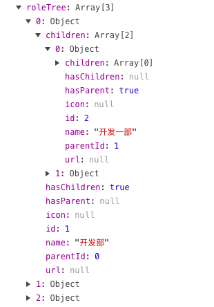

# ElementUI - Tree

在上一篇文章中我们介绍了Java后端如何构建一棵Tree树，并将数据返回给前端，前端Vue.js + ElementUI 又是如何渲染出来.

博文地址：[Shiro权限管理项目中，如何构建权限菜单？](https://tycoding.cn/2019/01/30/shiro-tree/)

这次呢，我们谈如何使用ElementUI中的Tree组件，用于部门、角色、菜单的修改添加上，以'部门管理'举例，效果如下：


<!--more-->

## 准备

* 首先请阅读ElementUI Tree组件官方文档：[传送门](http://element-cn.eleme.io/#/zh-CN/component/tree)

* 其次请阅读我的上篇文章：[Shiro权限管理项目中，如何构建权限菜单？](https://tycoding.cn/2019/01/30/shiro-tree/)

# 开始

## 渲染

### 前端

在写后端接口数据前（当然如何写在上篇文章也有提到），我们先绘出前端界面：

> 首先是Tree组件

```html
<el-form ref="form" :model="form">
    <el-form-item prop="parentId" v-model="form.parentId" label="上级部门" label-width="120px">
        <el-tree :data="roleTree" ref="tree" highlight-current show-checkbox check-strictly
                 :default-checked-keys="form.parentId"
                 :default-expanded-keys="form.parentId"
                 node-key="id"
                 :props="treeProps"></el-tree>
    </el-form-item>
</el-form>
```

**解释**

 | Attribute | Tips | 
 | :--- | :--- |
 | prop | 本例中用户表单校验 |
 | v-model | 双向绑定，格式为数组 |
 | :data | 封装tree数据的数组，用于渲染树形结构 |
 | show-checkbox | 显示勾选框 |
 | check-strictly | 严格模式，父子节点无关系，不联动勾选 |
 | node-key | 指定每个节点的key，最好就为节点的id值 |
 | :default-checked-keys | 默认选中的项，参数为封装了`node-key`的数组 |
 | :default-expanded-keys | 默认展开的项，参数为封装了`node-key`的数组 |
 | :props | Tree树节点的配置选项 |
 
> 其次是Vue.js部分

```javascript
new Vue({
    data: {
        //模态框状态标识
        dialogVisible: false,
        dialogTitle: '',
        roleTree: [], //部门Tree
        treeProps: {
            children: 'children',
            label: 'name'
        },
        //form表单对象
        form: {
            id: '',
            name: '',
            parentId: [],
        },
    },
    methods: {
        //触发保存按钮：添加、更新
        handleSave(id) {
            this.clearForm();
            //获取Dept列表
            this.$http.get(api.system.dept.roleTree).then(response => {
                this.roleTree = response.body.data;
            })
            if (id == null) {
                this.dialogTitle = '新增部门'
            } else {
                this.dialogTitle = '修改部门'
                this.$http.get(api.system.dept.findById(id)).then(response => {
                    this.form = response.body.data;
                    if (response.body.data.parentId == null) {
                        this.form.parentId = []
                    } else {
                        this.form.parentId = [response.body.data.parentId]
                    }
                })
            }
            this.dialogVisible = true;
        },
        clearForm() {
            if (this.$refs.form != undefined) {
                this.$refs.form.resetFields();
            }
            this.form.id = ''
            this.form.name = ''
            this.form.parentId = []
        },
    }
})
```

**解释**

代码基本如上了，需要注意以下几点：

* `roleTree`是绑定tree数据的数组，通过调用后端接口将response的tree数据赋值给`roleTree`

* `treeProps`是配置tree节点属性，比如上`children: 'children'`就是规定Tree组件的子节点名称为`children`，方便tree组件去识别后端的tree结构，具体看后端返回的数据格式

* 本例中`form`中的`parentId`既是Tree组件双向绑定的参数，也是`default-xx-keys`Tree组件默认选中和展开的参数，格式为`node-key`中多个key的数组，比如[key1,key2]

* 我这里新增和修改公用了一个model，如果是新增就直接展示mode即可(先获取Tree数据)，如果是修改，还要调用`findById`查询当前行的数据。

* 注意在`findById`的`then`中还进行了`this.form.parentId = [response.body.data.parentId]`，目的是将后端的`parentId`字符串转换为`[key]`数组，具体视后端tree数据格式，因为这里规定一个部门自能有一个上级部门，所以后端的`parentId`为String

#### 结

到这里前端的数据渲染部分已基本完成（注意我粘贴的代码中省略了一部分），下面看一下Tree组件的数据结构，即`roleTree`：



### 后端

上面可以看到Tree组件的数据格式，后端的任务就是获取数据库中的记录并封装为Tree树的结构返回给前端。

因为在 [Shiro权限管理项目中，如何构建权限菜单？](https://tycoding.cn/2019/01/30/shiro-tree/) 一文中已经介绍了如何将数据库中的记录封装为Tree树结构，这里不过多解释，直接上代码：

**service层实现**

```java
@Service
public class DeptServiceImpl extends BaseServiceImpl<Dept> implements DeptService {

    @Autowired
    private DeptMapper deptMapper;

    @Override
    public List<Tree<Dept>> tree() {
        List<Dept> list = queryList(new Dept());
        List<Tree<Dept>> treeList = new ArrayList<>();
        list.forEach(dept -> {
            Tree<Dept> tree = new Tree<>();
            tree.setId(dept.getId());
            tree.setParentId(dept.getParentId());
            tree.setName(dept.getName());
            treeList.add(tree);
        });
        return TreeUtils.build(treeList);
    }

    @Override
    public List<Dept> queryList(Dept dept) {
        try {
            Example example = new Example(Dept.class);
            if (StringUtils.isNotBlank(dept.getName())) {
                example.createCriteria().andCondition("name", dept.getName());
            }
            example.setOrderByClause("create_time");
            return this.selectByExample(example);
        } catch (Exception e) {
            e.printStackTrace();
            return new ArrayList<>();
        }
    }
}
```

#### 结

后端的代码我们在 [Shiro权限管理项目中，如何构建权限菜单？](https://tycoding.cn/2019/01/30/shiro-tree/) 中解释过了，这里不再讲解

## 编辑

### 前端

#### 实现Tree组件单选

> 修改html

```html
<el-form ref="form" :model="form">
    <el-form-item prop="parentId" v-model="form.parentId" label="上级部门" label-width="120px">
        <el-tree :data="roleTree" ref="tree" highlight-current show-checkbox check-strictly
                 :default-checked-keys="form.parentId"
                 :default-expanded-keys="form.parentId"
                 node-key="id"
                 @check-change="checkChange"
                 :props="treeProps"></el-tree>
    </el-form-item>
</el-form>
```

> 修改Vue.js部分

```javascript
//Tree控件节点选中状态改变触发的事件
checkChange(data, node, self) {
    if (node) {
        this.form.parentId = [data.id];
        this.$refs.tree.setCheckedNodes([data.id])
    } else {
        if (this.$refs.tree.getCheckedKeys().length == 0) {
            this.form.parentId = [];
        }
    }
},
```

**解释**

`@check-change`是节点选中状态改变触发的事件。

因为这里我们讲编辑功能，必然涉及对节点的编辑（比如修改父级节点、修改关联权限节点）。在本例中主要是修改部门的上级节点，又因为我们规定一个节点最多有一个上级节点，那么Tree组件的勾选节点应该变为**单选**，而官方的Tree组件都是多选的，所以看到上面我们新增的`checkChange()`方法中的实现，目的就是实现单选。

`checkChange(data, node, self)`方法中参数`data`是勾选（取消勾选）节点的tree数据（包含其所有子节点的数据）；`node`是当前触发节点是否被选中；`self`是当前节点本身是否被选中。

**坑**

`setCheckNodes()`是设置Tree组件选中的节点，`getCheckedKeys()`是获取Tree组件当前选中的节点。实现单选，就是实现：A节点选中，再勾选B节点时，先清空已勾选节点，再用`setCheckNodes()`手动设置Tree组件勾选节点；这样就实现了单选（选中B，就取消A勾选状态）。
而`setCheckNodes()`方法会触发`checkChange()`方法，所以要判断`this.$refs.tree.getCheckedKeys().length`。

注意Tree组件中的`:default-checked-keys`的参数也是`form.parentId`所以我们要时刻保证`parentId`是一个数组（尽管后端需要的是String），所以仅需要在`save()`保存更改的时候再修改`parentId`为String，并且修改完成后要立即把`parentId`变为数组。

**But**

以上都是在努力把Tree组件改为单选，But，如果你业务需要多选就不需要上述`checkChange()`方法中的判断了。

#### 保存更改

> HTML触发保存按钮

```html
<el-button type="primary" @click="save('form')">确 定</el-button>
```

你可能会注意到`save('form')`中`'form'`是什么鬼？其实他是`<el-form>`中的`prop="form"`，目的是为了实现表单校验功能，具体看官方文档：[传送门](http://element-cn.eleme.io/#/zh-CN/component/form)

> Vue.js中新增`save`方法

```javascript
//保存
save(form) {
    this.$refs[form].validate((valid) => {
        if (valid) {
            this.dialogVisible = false;
            this.form.parentId = this.form.parentId[0]
            if (this.form.id == null || this.form.id == 0) {
                //添加
                this.$http.post(api.system.dept.add, JSON.stringify(this.form)).then(response => {
                    if (response.body.code == 200) {
                        this._notify(response.body.msg, 'success')
                    } else {
                        this._notify(response.body.msg, 'error')
                    }
                    this.clearForm();
                    this.init()
                    this.search(this.pageConf.pageCode, this.pageConf.pageSize)
                })
            } else {
                //修改
                this.$http.post(api.system.dept.update, JSON.stringify(this.form)).then(response => {
                    if (response.body.code == 200) {
                        this._notify(response.body.msg, 'success')
                    } else {
                        this._notify(response.body.msg, 'error')
                    }
                    this.clearForm();
                    this.init()
                    this.search(this.pageConf.pageCode, this.pageConf.pageSize)
                })
            }
        } else {
            return false;
        }
    })
},
```

### 后端

上面对部门的添加和修改节点其实都比较简单些，直接将前端数据保存进数据库即可，这里我们将一下节点的删除：

#### 节点删除

节点删除，主要涉及：

* 根据ID删除此id对应的数据库中的记录

* 如果此表于其他表有关联（比如 角色按钮关联表），还需要根据id删除其关联表中的记录。（此处的关联不是外键关联）

* 修改此节点的父级节点ID，比如B节点的父级简单是A，删除了A，B节点应该是A节点那一级

举例：改变父级节点，`service`层实现如下：

```java
@Override
@Transactional
public void delete(List<Long> ids) {
    this.batchDelete(ids, "id", Dept.class);
    this.deptMapper.changeTopNode(ids);
}
```

`deptMapper`的mapper.xml如下：

```xml
<update id="changeTopNode">
    update tb_dept
    set parent_id = 0
    where id in (select a.id
    from (select id from tb_dept where parent_id in
    <foreach collection="list" item="id" index="index" open="(" close=")" separator=",">
        #{id}
    </foreach>
    ) a);
</update>
```

**注意**

* `ids`是一个`List<Long>`集合，目的是实现批量删除功能。在Mybatis中遍历集合就要用`<foreach>`

将上面

```sql
select id from tb_dept where parent_id in
<foreach collection="list" item="id" index="index" open="(" close=")" separator=",">
    #{id}
</foreach>
```

拆分，大概就是这样一段SQL：

```sql
select id from tb_dept where parent_id in (1, 2)
```

**注意**

```sql
select a.id from (select id from tb_menu where parent_id in (1, 2)) a;
select id from tb_menu where parent_id in (1, 2);
```

上述两种方式都能查询出来parent_id是(1,2)的记录行的id值。而第一种方式是先生成一张临时表a，再查询id值

```sql
update tb_menu
set parent_id = 0
where id in (select a.id
             from (select id from tb_menu where parent_id in (1, 2)) a);

update tb_menu
set parent_id = 0
where id in (select id from tb_menu where parent_id in (1, 2));
```

若执行后者会报错：`You can't specify target table 'tb_menu' for update in FROM clause`，
百度查到是由于mysql不能对一张表查询到某些值就同时更新这张表，通过生成一张临时表来避免这个问题


